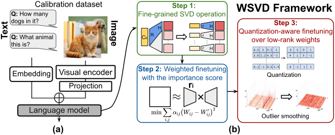

# WSVD: Weighted Low-Rank Approximation for Fast and Efficient Execution of Low-Precision Vision-Language Models

<!-- [arXiv](https://arxiv.org/abs/###) -->
[arXiv](https://arxiv.org/abs/2604.02570) | [OpenReview](https://openreview.net/forum?id=zrmQ4koOw9)

This repository provides the official implementation of **WSVD**, a method for efficient low-rank approximation for fast and efficient execution of Low-Precision Vision-Language Models (VLMs).





<!-- <p align="center">
  <a href="https://neurips.cc/Conferences/2025">
    
  </a>
</p> -->
<p align="center">🎉 Our work has been accepted to ICLR 2026.</p>

## 🌟 Highlights

- **🧩 Per-head SVD to actually speed up decoding:**  
  WSVD applies SVD per attention head to avoid the “shared-latent reloading” overhead that can make conventional SVD slower at decode time, cutting KV-cache memory traffic and reconstruction cost.

- **🎯 Accuracy-preserving compression: Fisher-weighted local FT + local QAT:**  
  WSVD uses element-wise importance to guide local fine-tuning of low-rank factors, then adds quantization-aware training with outlier handling—yielding a low-precision low-rank VLM with only ~1% average accuracy drop vs FP16 while using much smaller cache/params.

- **📊 System-level Triton fusion with Flash Decoding for real latency wins:**  
  WSVD integrates low-rank reconstruction directly into the flash-decoding fused kernel (no materializing full K/V), translating rank reduction into practical speedups more than 1.8× decoding speedup vs. Flash Decoding.

## 🔧 Requirements

This implementation utilize the [myllava](myllava) repository, adapted from the original [LLaVA repo](https://github.com/haotian-liu/LLaVA). Please follow the steps below to set up the environment:

```bash
git submodule update --init --recursive

conda create -n WSVD python=3.10 -y
conda activate WSVD

pip install torch==2.6.0 torchvision==0.21.0 torchaudio==2.6.0 --index-url https://download.pytorch.org/whl/cu126
# Or install torch/torchvision/torchaudio versions matching your CUDA version

pip install --no-build-isolation -r requirements.txt
```

## 📊 Evaluation

To evaluate WSVD and reproduce our results, follow the steps below.

### 📁 Dataset Preparation

Follow guidance to prepare the following datasets:
- **ScienceQA** (Train) [LLaVA ScienceQA train](script/setup_sqa_train)
```bash  
 # Use the shell script to download and process the calibration data 
 cd  path_to_WSVD
 bash script/setup_sqa_train/download_sqa_train.sh
 bash script/setup_sqa_train/convert_sqa_train.sh

```
 Update the paths in `data_utils.py` accordingly.

### 🛠 Evaluation Toolkit

We use [third_party/VLMEvalKit](https://github.com/open-compass/VLMEvalKit/blob/main/docs/en/Quickstart.md) for evaluation. Please follow its Quickstart for environment setup and usage.

### ▶️ Running Evaluations

We provide **pre-computed calibration cache files** to directly reproduce the main WSVD results  without rerunning the whitening data and gradient collection. All pre-computed cache files can be downloaded from HuggingFace. 

Currently released model cache:
> [**LLaVA-1.5 7B**](https://huggingface.co/Etropyyy/wsvd-cache/tree/main/llava-1.5-7b)  
> [**LLaVA-1.5 13B**](https://huggingface.co/Etropyyy/wsvd-cache/tree/main/llava-1.5-13b)   
> [**LLaVA-Next 7B**](https://huggingface.co/Etropyyy/wsvd-cache/tree/main/llava-next-7b)  
> [**LLaVA-Next 13B**](https://huggingface.co/Etropyyy/wsvd-cache/tree/main/llava-next-13b)

To reproduce our main results on ScienceQA with the provided cache files, please refer to the [instruction](script/local_qat/README.md) here.

### 🏎️ Efficiency
To evaluate the speedup of our fused Triton kernel over Flash Decoding on RTX 4090/5090 GPUs, run:
```bash
python efficiency/test_timing_layer.py
```


### 🔎 More Details

For more usage and custom evaluations, explore the instructions and scripts in [fake_quant](fake_quant/README.md) and [scripts](script). Currently, we only support **LLaVA-v1.5, LLaVA-Next** models. You can simply run the `main_llava.py`, or `main_llava_next.py` accordingly to reproduce the results in the paper. The most important arguments are:

- `--model`: Model name (or path to the weights).
- `--seed`: Control the random seed.
- `--nsamples`: Number of samples for SVD calibration. 
- `--rotate`: Whether we want to rotate the model (apply quarot).
- `--tasks`: Tasks for LM-Eval.
- `--cal_dataset`: Calibration dataset for GPTQ quantization/SVD calibration (currently support `ScienceQA_Train`).
- `--eval_dataset`: Evaluation dataset (currently support `ScienceQA_TEST`).
- `--a_bits`: Number of bits for activation quantization.
- `--w_bits`: Number of bits for weight quantization.
- `--weighted_svd`: Enable WSVD local FT and QAT (with `--is_quant_aware_ft`).
- `--rank_ratio`: When `--use_true_param_ratio` is provided, this is interpreted as the parameter ratio. 
- `--localft_iters`: Total iterations of local fine-tuning plus QAT.
- `--localft_lr`: Learning rate for local fine-tuning.
- `--qat_start_iter`: Fraction in [0, 1] indicating when QAT starts within the total iterations; use this to split FT and QAT iteration counts. Iterations for FT: localft\_iters $\times$ qat\_start\_iter; for QAT: localft\_iters $\times$ (1 - qat\_start\_iter).
- `--qat_lr_UV`: Learning rate for low-rank factors (`U/V`) during local QAT.
- `--qat_lr_R`: Learning rate for rotation matrix `R` during local QAT.

## 📚 Citation

If WSVD helps your research or applications, please cite our paper:

```
@inproceedings{wangwsvd,
  title={WSVD: Weighted Low-Rank Approximation for Fast and Efficient Execution of Low-Precision Vision-Language Models},
  author={Wang, Haiyu and Wang, Yutong and Jiang, Jack and Zhang, Sai Qian},
  booktitle={The Fourteenth International Conference on Learning Representations}
}
```

## 🤝 Contributing

This project builds upon the excellent work of:
- [QSVD](https://github.com/SAI-Lab-NYU/QSVD)
- [QuaRot](https://github.com/spcl/QuaRot)
- [ASVD](https://github.com/hahnyuan/ASVD4LLM)
- [SVDLLM](https://github.com/AIoT-MLSys-Lab/SVD-LLM)
- [LightLLM](https://github.com/ModelTC/LightLLM)

We thank these projects for their contributions to the community.
